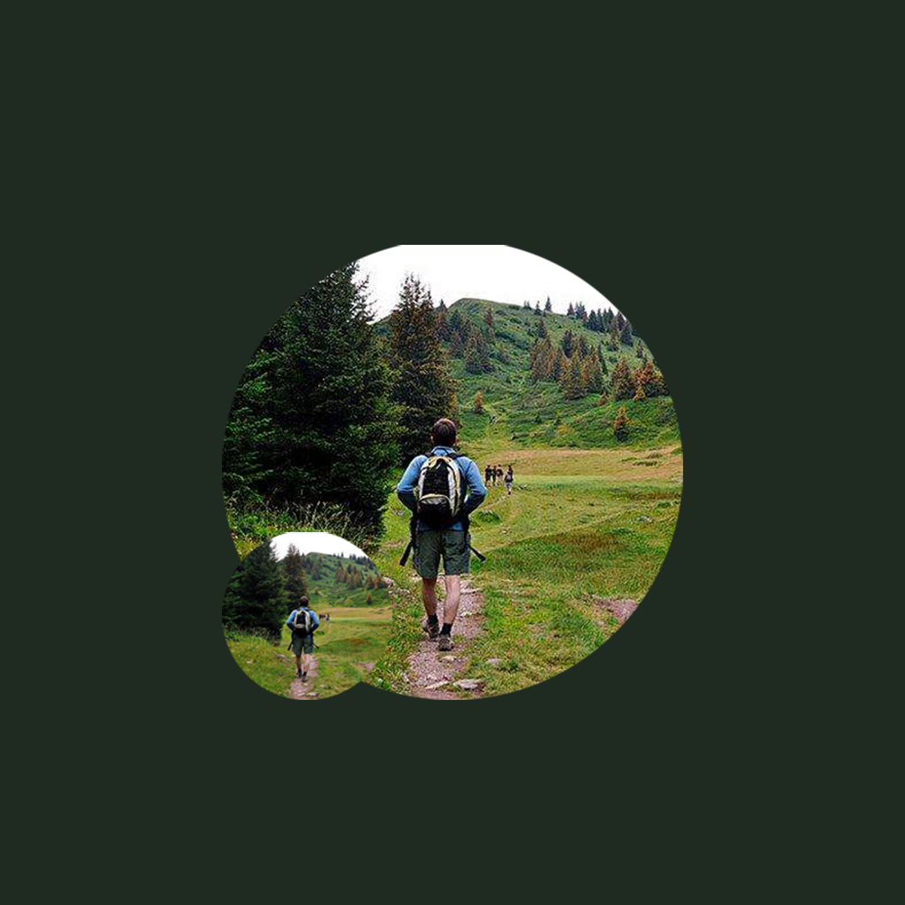

## 欢迎来到 我的徒步登山记录工具

每一次徒步登山都是一次非常有趣和有意义的事情，在登山过程中，有汗水，有家人朋友的鼓励和帮助，让你有力量登上山顶，看到山上美丽的景色。你可以把这次珍贵的回忆记录起来，你可以记录当时登山的海拔高度，实际到达的高度，登山时的天气情况和休息时长等信息。你还可以记录当时登山的收获和感受，激励和帮助自己分析和享受每次徒步登山带来的快乐。

如果您遇到什么需要解答的问题，请发送您的问题到以下邮箱。

我们将第一时间为您解答。

### 邮箱地址: zhanghesongyuan7@126.com

谢谢！
